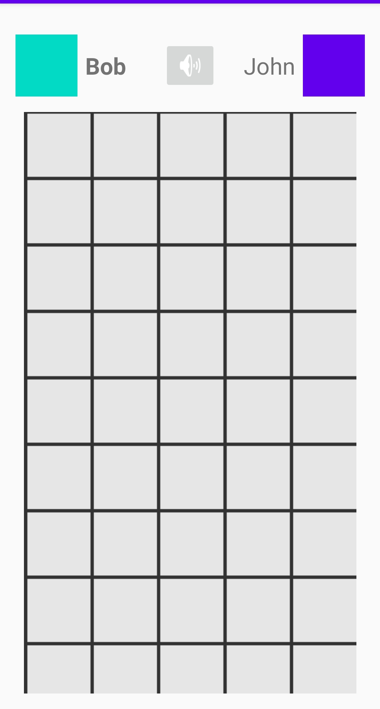
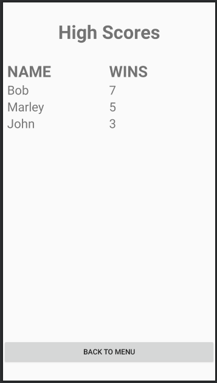

# 1. A rendszer céljai és nem céljai.
## 1.2 A rendszer céljai:
Egy egyedi játékszabályokkal bővített amőba játék telefenos applikáció formájában. A telefonos platformok közül az androidot céloztuk meg.
Lehetővé tesszük, hogy mind a két játékos egy eszközről tudjon játszani egymás ellen, így nem szükséges, hogy mind a két fél rendelkezzen egy androidos telefonnal.
Minden játék végén megjelenítünk statisztikai adatokat. Az adatokat játékosokhoz kötve tároljuk. Ezt az teszi lehetővé, hogy a játék kezdete előtt a játékosok megadják a nevüket.

## 1.3 A rendszernek nem célja:
 - androidon kívül egyéb telefonos platformokra való fejlesztés.
 - AI fejelsztése

# 2. Jelenlegi helyzet
A jelenleg elérhető amőba játék sok ember számára ismerős lehet, legtöbben papirra felrajzolva játszák 3X3-as pályán, létezik olyan
változat is ami már elérhető mobilos applikációként is viszon ezek legtöbbje nem menti el a győzteseket és sok esteben előfordulnak benne
hibák. Az előre meghatározott pálya méretet nem mindenki szereti, főleg azok akik mindig nyerni akarnak, de ha be telik a játéktér akkor bizony nincs
győztes. Felhasználói felületük kezelése sokak számára nem mindig egyértelmű, vagy épp túl bonyolult.
# 3. Vágyálomrendszer
  Egy olyan felhasználói felülettel ellátott szoftvert készítünk, amihez 2 játékos szükséges.
A játékosok először kiválaszthatják, hogy mely szimbólummal szeretnének játszani, ezután felépítjük a pályát. Amint egy játékos a játék szabályai szerint
győztesen kerül ki, hangeffekttel jelezzük. Amennyiben már nincs több hely lépni a pályán, viszont egyik játékos sem került ki győztesen, a pálya keretein
kívül újabb mezők jelennek meg, amik körbeölelik a pályát, amit szintén hangeffekttel illetünk. Egy játékos győzelmekor a képernyőre írjuk a nevét és a
játék adatait, azaz a lépések számát és az időt. A játékban jól elkülöníthető szimbólumok lesznek.
# [4. Jelenlegi üzleti folyamatok modellje](Követelményspecifikáció.md#3)
4.1 Játék indítása.\
4.2 Játékmezők elfogynak.\
4.3 Opcionális stretégia esetén minden esetben döntetlen az eredmény.
# [5. Igényelt üzleti folyamatok modellje](Követelményspecifikáció.md#4)
Ábra megtalálható a 7. pontban, a használati esetekben.
# [6. Követelmény lista](Követelményspecifikáció.md#6)
# 7. Használati esetek [Use cases]

# 8. Megfeleltetés, hogyan fedik le a használati esetek a követelményeket
- K01 Egyszerű, letisztult környezet
  - A start gombra kattintva egy egyszerű, fehér hátterű négyzetháló generálódik, amelyen fekete X és O jelek fognak felváltva kirajzolódni
- K02 Játszmák alatt háttérzene
  - A játék kezdetekor egy relaxáló hatású háttérzene fog ismétlődni
- K03 Győztest jelző hangüzenet
  - A győztes nevének képernyőre írása után egy tapsoló hangüzenet fog lejátszódni
- K04 Döntetlen játékállás esetén bővülő pálya
  - Amennyiben megtelik a pálya, de a játszmának még nincs győztese, a pálya egy új sorral és egy új oszloppal fog bővülni
- K05 Játékosok adatainak JSON formátumú állományban való eltárolása
  - A programban lehetőség lesz a statisztikák megnézésére, hogy kinek hány alkalommal sikerült nyernie, ez a High Scores feliratú gomb megnyomásával érhető el
# 9. Képernyő tervek
## 9.1   
Az első lépernyőről egy gombnyomással elindíthatjuk a játékot vagy megnézhetjük, hogy ki hányszor nyert, illetve kiléphetünk a játékból ha már nincs időnk játszani. A jobb felső sarokban levő gombbal ki/be kapcsolhatjuk a hangot. Ezek a legalapvetőbb funkciók, amelyeket valaki a menüből el akarna érni.
## 9.2   
Amikor a menüből elindítjuk a játékot, ez a képernyő jelenik meg, ahol a játékosok a szövegmezőkben megadhatják a nevüket és a képre kattintva kiválaszthatnak egy képet a karakterüknek. Végül a "START" gombra nyomva elindítható a játék.
## 9.3   
A képernyő tetején a játékosok ikonja mellett látható a nevük. A jelenlegi játékos neve ki van emelve, ezzel jelezve, hogy ő következik. A képernyő közepén helyezkedik el a játékmező, amely mozgatható. A játék végén megnyílik a "High score" képernyő, ahol megtekinthetjük, hogy ki hányszor nyert.
## 9.4   
Ezen a képernyőn név alapján megnézhetjük, hogy ki hányszor nyert. A "BACK TO MENU" gombra menve visszaléphetünk a főmenübe.

# 10. Forgatókönyvek
Amikor felhasználók az alkalmazást megnyitva a kezdőképernyőn kiválasztják hogy 1v1 elleni játékot szertnének játszani, majd beírják a nevüket. A nevek alatti start gombra
kattintva indul is a játék. Átkerülnek a játéktérre ami egy négyzetháló ami kezdetben 3X3-as, erre felváltva elhelyezik az X illetve az O jelet. Ha ez a játákmező megtelik
és nincs nyertes, akkor a játéktér bővül egy új sorral és oszloppal. Ez mindaddig ismétlődik míg az egyik játékosnak sikerül egy sorba, oszlopba vagy átlóba 3 azonos jelet
elhelyezni. Amint megvan a nyertesünk, megjelenik, hogy ki a nyertes. Ezek után kezdhetnek egy új játékot vagy a "High Scores" nevű gombra kattintva megnézhetik hogy össszesen
kinek hány alkalommal sikerült nyerni. Ha pedig nem szeretnének többet játszani akkor az "Exit" gombra kattintva bezárhatják a játékot.
# 11. Fogalomszótár
