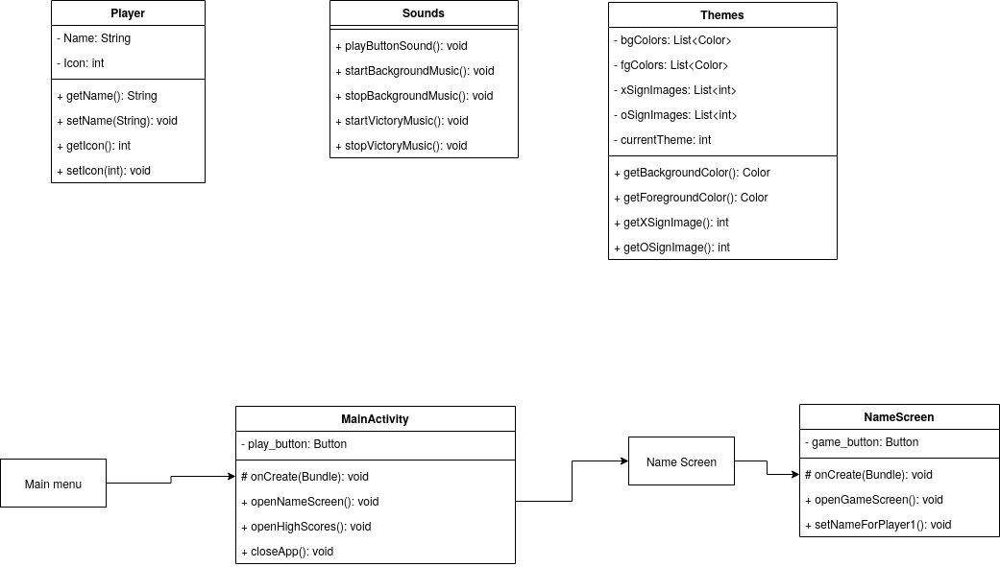

# 1. A rendszer céljai és nem céljai
## 1.2 A rendszer céljai:
Egy egyedi játékszabályokkal bővített amőba játék telefenos applikáció formájában. A telefonos platformok közül az androidot céloztuk meg.
Lehetővé tesszük, hogy mind a két játékos egy eszközről tudjon játszani egymás ellen, így nem szükséges, hogy mind a két fél rendelkezzen egy androidos telefonnal.
Minden játék végén megjelenítünk statisztikai adatokat. Az adatokat játékosokhoz kötve tároljuk. Ezt az teszi lehetővé, hogy a játék kezdete előtt a játékosok megadják a nevüket.

## 1.3 A rendszernek nem célja:
 - androidon kívül egyéb telefonos platformokra való fejlesztés.
 - AI fejelsztése

# 2. Projekt terv
## 2.2 A projekt résztvevői:  
A projekten 4 programtervező informatikus hallgató dolgozik, egyenlő munkakörben,
   - Rádi Dániel (fejlesztő)
   - Simion Tamás (fejlesztő)
   - Nagy Kristián (fejlesztő)
   - Puskás Máté (fejlesztő)
## 2.3 Ütemterv:
   - Projekt kezdete: 2020.09.07.
   - Követelményspecifikáció határideje: 2020.09.14.
   - Funkcionális specifikáció határideje: 2020.09.21.
   - Rendszerterv határideje: 2020.09.21.
   - Projekt elkészítésének határideje: 2020.10.05.
# 3. Üzleti folyamatok modellje
## 3.2 Üzleti szereplők
A programot használó felhasználók.
## 3.3 Üzleti folyamatok

## 3.4 Üzleti entitások
A játékban résztvevő játékosok.
# 4. Fizikai környezet
## Hardver:
Hogy egy ilyen egyszerű játékot akárhol és akármikor játszhasson az ember, ahhoz manapság az okostelefonok a legjobb választás.
## Operációs rendszer:
Az operációs rendszerek közül az androidot választottuk, hogy így több felhasználót érjünk el.
## Fejlesztői eszközök:
A rendelkezésünkre álló szoftverek közül csapatunk az Android Studio nevű IDE-t fogja használni a fejlesztéshez, amely a Gradle fejlesztői projektautomatizációs eszközt használja. Itt a UI-t is meg tudjuk tervezni, amelyel párhuzamosan generálja belőle az xml fájlt.   
Az Android Studio 2 programozási nyelvben is lehetővé teszi a fejlesztést:
- Java
- Kotlin  
Mivel a csapatunk a Java nyelvet ismeri, így a fejlesztés során is azt fogjuk használni.
# 5. Funkcionális terv
A megalkotott mobil platformon elérhető játékot minden olyan felhasználó eléri aki renderkezik, android operációs rendszerű
készülékkel, legyen az telefon vagy akár táblagép. Megjelenésben egy olyan felületet kap amin mindenki számára egyértelmű gombok
és üzenetek lesznek ezzel is megkönnyítve akár a kisiskolások vagy akár az idősek dolgát akik nem értenek annyira a mobil platformos
technológiához.
# 6. Implementációs  terv:

# 7. Testterv
Tesztelés során több részét is vizsgáljuk majd a programnak.
- megfelőlen jelenik-e meg, nem fedik egymás a megjelenő gombok/szövegek
- ha megtelt a játéktér ellenőrizze hogy van-e győztes
- ha nincs akkor megfelelően van az bővítve, illetve normális módon jelenik meg
- győztes esetén jó név kerül kiírásra és megkapja e a játékos a hangüzenetet
- megfelelően kerül elmentésre a győzelmek száma a "High Scores"-ba
