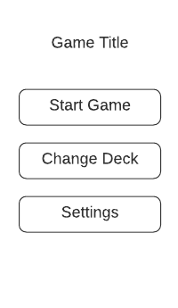

# 1. A rendszer céljai és nem céljai.
### Célok:
- Android alapú játék.
- Egy játékossal élvezhető játékmenet.
- Texas Hold'Em játészabály.
- Értékelhető és érzékelhető előrehaladás a játékmenetben.
### Nem cél:
- Egyéb platformok.
- Egyéb játékszabályok.
- Többjátékos mód.
# 2. Jelenlegi helyzet
# 3. Vágyálomrendszer
# 4. Jelenlegi üzleti folyamatok modellje

4.1 A játékos kiosztja a kártyákat.

4.2 Játékszabály szerint kisvagy és nagyvak eldöntése.

4.3 Négy Licit kör kijátszása:

4.3.1 A játékos tetszés szerint emel, tart vagy dob.

4.3.2 Pre-flop, Flop, Turn, River kártyaosztás.

4.4 Showdown, a játkosok lapjainak mutatása.  A játékos nyer vagy veszít.

4.5 A játékos felírja az eredményt magának.

4.6 A játékos összegyűji és újrakeveri a kártyát.

4.7 A játékos újrakezdi a folyamatot előrehaladási élmény nélkül.

# 5. Igényelt üzleti folyamatok modellje
# 6. Követelmény lista
- K01 A játék kövesse a hivatalos nemzetközi  Texas Hold'Em játékszabályokat.
- K02 A játéknak jutalmaznia kell a győzelmet és jeleznie az előrehaladást.
- K03 A program legalább az android rendszerek 95%-án működjön.
- K04 A szoftver megvalósítása Java programozási nyelvben kell hogy történjen.
- K05 Az UI megvalósításához xml-t kell használni.
- K06 A mentéseket titkosítva kell lokálisan tárolni.
- K07 Képfájlok jpg/png formátumúak legyenek.
- K08 A hangfájlokat wav kiterjesztéssel kell kezeléni.
# 7. Használati esetek
### Játékos
- Játéklogikával való interakció: Tart, Dob, Emel
- Játékállapot olvasása.
- Eredmények rögzítése.
- Eredmények megtekintése.

# 8. Megfeleltetés, hogyan fedik le a használati esetek a követelményeket
# 9. Képernyő tervek
 

 

 

 

# 10. Forgatókönyvek
# 11. Fogalomszótár
