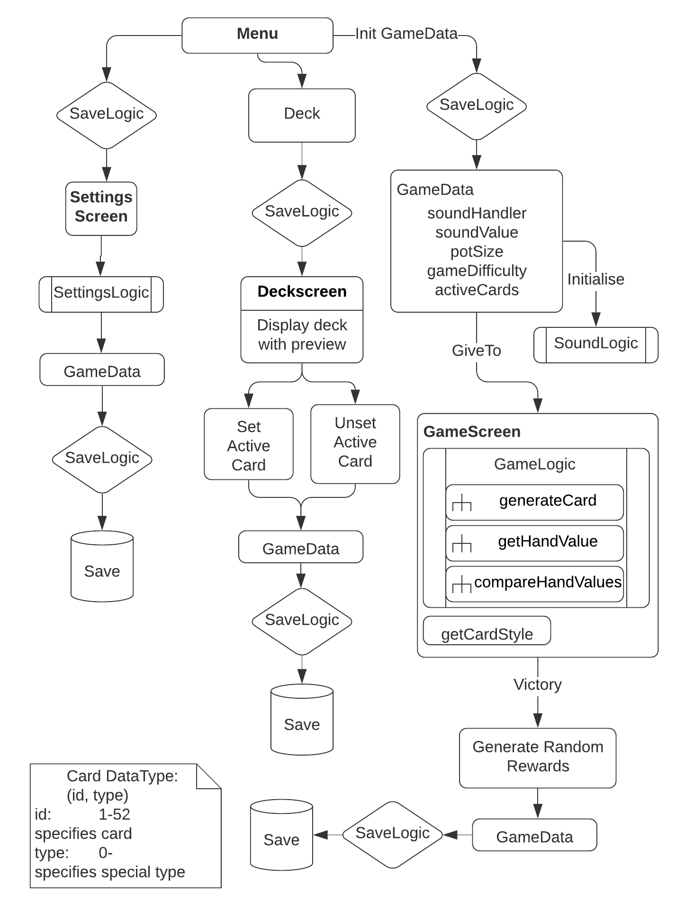

# 1. A rendszer céljai és nem céljai.
### Célok:
- Android alapú játék.
- Egy játékossal élvezhető játékmenet.
- Texas Hold'Em játészabály.
- Értékelhető és érzékelhető előrehaladás a játékmenetben.
### Nem cél:
- Egyéb platformok.
- Egyéb játékszabályok.
- Többjátékos mód.
# 2. Jelenlegi helyzet
A póker az egyik legnépszerűbb kártyajáték a világon. Minden esetben a játék lényege, hogy a játékosok a  kártyáikból a legjobbat 
kihozva elvigyék az asztal közepén lévő kasszát. Ezt a legjobb lap kombinációval tehetik meg, tehát minden játékosnak 
arra kell törekednie, hogy a saját kezében vagy a saját kézben tartott és a lenti kártyák összessége legyen a legjobb.

A Texas Hold'Em a közössági pókerjátékok legismertebb változata, amin 2-10 játékos vesz részt. A játékot 52 lapos francia
kártyával játszák a joker lapok nélkül. A játék kezdetekor minden játékos kap két zárt lapot, amit a játékoson kívül más nem lát
majd ezt követi öt közös nyílt lap ami színnel fölfele amit minden játékos lát és felhasználhat. Ebből a hét ismert lapból 
(2 ami kézben van + 5 ami az asztalon található) kell kihozni a legjobb ötlapos kombinációt. A végén az viszi el a kasszát akinek
a legerősebb pókerkezet(öt lapot) sikerült összegyűjteni. 

Ahogy sok minden más kártya játékot úgy ezt is utól érte a technológia, így már 
ez a kártya játék is játszható online környezetben vagy épp mobilos környezetben is. Aki rendelkezik okos eszközzel annak 
egy pár kattintás és már élvezheti is a játékot, viszont ezek tele vannak reklámmal, amiknek java része nem is kapcsolódik 
a témahoz ezzel sok embert zavarva, illetve mikrotranzakcióval amivel arra az útra probálják terelni a játékost, hogy zsetont
vegyen, vagy olyan dolgokra költsön amiket a játékmenet előrehaladásával amúgy is megszerezne.
# 3. Vágyálomrendszer
Az általunk megalkotott póker játék bárki számra elérhető lesz aki rendelkezik Adndroid operációs rendszerrel rendelkező
készülékkel. Biztosítjuk a játszani vágyó szemálynek hogy 100%-ban reklámmentes játékélményben részesül majd, illtve azt is,
hogy nincs semmi szüksége valódi pénzt belefektésnek a játékba mivel, minden mérföldkő és jutalom megszerezhető lesz e nélkül.

A játékot egy személy fogja tudni játszani egy számítógép ellen. A játék kezdésekor mindketten ugyan annyi számú
zsetonnal kezdenek, a végén  pedig az nyer akinek sikerül elvennie ellenfele összes zsetonját. A játékmenet során kártya skineket 
majd feloldani. Ezek külömböző kártya kombinációk(pl. két pár) elérésekot fognak megnyílni majd számára. 

Az elérhatő skinek
között lesz common, ide tartoznak majd az egyszerű színes kártyák (pl. kék színű). Lesz rare típusú, ami arany színű kártya lesz
majd, illetve egy darab speciális ami akkor fog megnyilni ha a játékosnak sikerült megnyitnia az összes arany kártyát.
# 4. Jelenlegi üzleti folyamatok modellje

4.1 A játékos kiosztja a kártyákat.

4.2 Játékszabály szerint kisvagy és nagyvak eldöntése.

4.3 Négy Licit kör kijátszása:

4.3.1 A játékos tetszés szerint emel, tart vagy dob.

4.3.2 Pre-flop, Flop, Turn, River kártyaosztás.

4.4 Showdown, a játékosok lapjainak mutatása.  A játékos nyer vagy veszít.

4.5 A játékos felírja az eredményt magának.

4.6 A játékos összegyűji és újrakeveri a kártyát.

4.7 A játékos újrakezdi a folyamatot előrehaladási élmény nélkül.

# 5. Igényelt üzleti folyamatok modellje
- Beállítások => Hang, Pot méret, Nehézség, Adattörlés
- Pakli => Jutalom kártyák megjelenítése => Jutalom kártyák aktiválása
- Játék => Játék folyamat => Győzelem esetén jutalom

  

# 6. Követelmény lista
- K01 A játék kövesse a hivatalos nemzetközi  Texas Hold'Em játékszabályokat.
- K02 A játéknak jutalmaznia kell a győzelmet és jeleznie az előrehaladást.
- K03 A program legalább az android rendszerek 95%-án működjön.
- K04 A szoftver megvalósítása Java programozási nyelvben kell hogy történjen.
- K05 Az UI megvalósításához xml-t kell használni.
- K06 A mentéseket titkosítva kell lokálisan tárolni.
- K07 Képfájlok jpg/png formátumúak legyenek.
- K08 A hangfájlokat wav kiterjesztéssel kell kezeléni.
# 7. Használati esetek
### Játékos
- Játéklogikával való interakció: Tart, Dob, Emel
- Játékállapot olvasása.
- Pakli változtatása.
- Beállítások szerkesztése.

# 8. Megfeleltetés, hogyan fedik le a használati esetek a követelményeket
# 9. Képernyő tervek
### Menü
 
- Játék kezdése
- Pakli cseréje
- Beállítások
### Játék
 
- AI pénze
- Kör nyeremény pot
- Kiterített lapok
- Döntésgombok
- Játékos pénze
- Játékos lapjai
### Pakli
 
- Minden jutalom kártyát mutat ABC sorrendben
- Kattintással lehet aktíválni
### Beállítások
 
- Hangerő
- Pot mérete
- Nehézség
- Mentés törlése gomb
# 10. Forgatókönyvek
Amint a felhasználó megnyitja a programot, szembetalálja magát a játék kezdőképernyőjével. Ezen a képen lesz lehetősége megadni a nevét, illetve lesz lehetősége arra is, hogy profilképet válasszon magának a saját galériájából, ha szeretne. Ezen a képernyőn lesz még lehetősége a játék alatt lévő háttérzene nemítására is, valamint a játékban használt kártya skin kiválasztására is. A játék képernyője a start gomb megnyomása után válik láthatóvá. Ezen a képen fog zajlani a játék. Ezen képernyő alján fog elhelyezkedni a játékos neve, profilképe, a számára kiosztott két kártya, illetve a zsetonjainak száma. A képernyő tetején pedig ugyanezen felosztásban - a profilkép nélkül -  az ellenfele adatai lesznek láthatóak, természetesen a számára kiosztott kártyák hátulja lesz látható. A két játékos között, a képernyő közepén bal oldalon fog elhelyezkedni a pakli, tőle jobbra az öt közös lap foglal majd helyet. Amikor a felhasználó következik lépni, megjelennek számára a Texas Hold'Em szabályai szerint az adott körben végrehajtható lépések, (tartás, emelés, dobás, stb...) amelyek közül választania kell. A játszma addig fog tartani, amíg az egyik fél meg nem szerezte ellenfele összes zsetonját. Amennyiben a felhasználó győzedelmeskedik, a játék megjutalmazza egy kártya skin-nel, amely lehet átlagos és ritka előfordulású.
# 11. Fogalomszótár
- Chip: A játék valutája.
- Pot: Chipek kupaca
- Pakli: Kártyalapok összegsége
- Pre-flop, Flop, Turn, River: A körök megnevezése, 1. től a 4.-ig.
- Kisvak, Nagyvak: Póker szabály, a játék kezdetekor kötelező kezdőööszeget kell betenni bizonyos játékosoknak.
- pokerkéz: kártyakombináció
- mikrotranzakció: játékon belüli valós pénzért történő vásárlás
- zseton: kaszinókban használt érme
- common: közönséges, általános
- rare: ritka
- kártyakombinációk:
  - Rojálflös (royal flush) : Ez a legjobb az összes pókerlap közül, a royal flös egy olyan színsor, amely tízest, bubit, dámát, királyt és ászt tartalmaz.
  - Színsor (straight flush): Egy sor (lejjebb definiált), amelyben az összes kártya azonos színű.
  - Póker (four of a kind): Négy ugyanolyan értéku kártya, például négy dáma.
  - Full (full house): Egy pár és egy drill kombinációja.
  - Flös (flush): Öt ugyanolyan színu kártya, például öt kör.
  - Sor (straight): Öt egymást követo értéku kártya, az ászt alacsony és magas kártyának is lehet használni.
  - Drill (Three of a kind): Három azonos értéku kártya, például három dáma.
  - Két pár: Kétszer két ugyanolyan értéku kártya, például két hármas és két kilences.
  - Pár: Bármilyen két azonos értéku kártya, például két kilences. A párok rangsora tükrözi a kártyák rangsorát, tehát a legerosebb pár az ász pár, a leggyengébb a kettes pár.
  - Magas kártya: A legmagasabb értéku kártya az ász, a legalacsonyabb a kettes.
