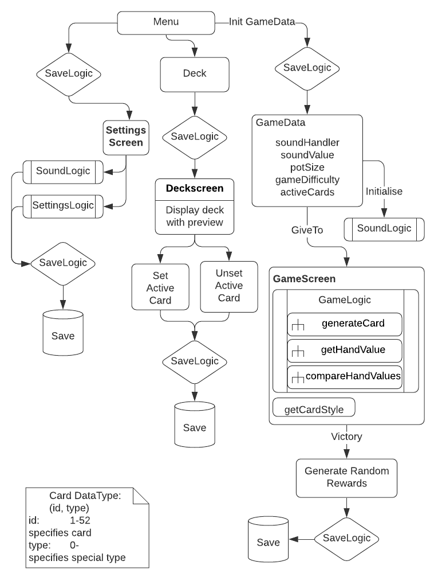

# 1. A rendszer céljai és nem céljai
## 1.1 A rendszer céljai:
A mai világban rengeteg pókerjáték megtalálható. A mi célünk nem egy újabb ilyen játék létrehozása, hanem a játék alapjaira támaszkodva egy kis segítségnyújtás azon felhasználók számára, akik nem rendelkeznek elég tudással a játékról, és szeretnék tudásukat tét nélkül csiszolni. Az ingyenes póker játékok ugyanis általában tele vannak hírdetésekkel, amik élvezhetetlenné teszik a játékot. A hírdetés nélküli játékért pedig bizony fizetnünk kell, és nyílvánvalóan a saját pénzünk forog kockán az egyes játszmákban. Éppen ezért választottuk az egyjátékos módszert, itt ugyanis a számítógép ellen kell a felhasználónak helytállnia, és vereség során nem veszít semmit sem. Ezáltal elsajátíthatja a játék alapjait, és bár az emberi ravaszság nem jelenhet meg ellenfelénél, egy egész jó rálátást fog biztosítani a játék menetére. Motiváció gyanánt pedig győzelem során kártya kinézetet oldhat fel a játékos.
## 1.2 A rendszernek nem célja:
- Nem szándékozunk hírdetésekkel bombázni a felhasználót, ezzel pedig elrontani a játékélményét.
- többjátékos játszmák
- player vs player mód
- nem áll szándékunkban a pénzvesztés kockázatának kitenni a felhasználót
- a felhasználót úgymond "magára hagyni", vagyis nem jutalmazni, ha nyertesként kerül ki
- androidon kívül más platformra kiterjeszteni a játékot

# 2. Projekt terv
## 2.1 A projekt résztvevői:
A projekten 4 programtervező informatikus hallgató dolgozik, egyenlő munkakörben,
   - Rádi Dániel (fejlesztő)
   - Simion Tamás (fejlesztő)
   - Nagy Kristián (fejlesztő)
   - Puskás Máté (fejlesztő)
## 2.2 Ütemterv:
- Projekt kezdete: 2020.10.12.
- Dokumentációk határideje: 2020.10.26.
  - Követelményspecifikáció: 2020.10.19.
  - Funkcionálisspecifikáció: 2020.10.19.
  - Rendszerterv: 2020.10.26.
- Fejlesztési sprintek: 2020.11.30.
  - első fejlesztési sprint: 2020.11.02.
  - második fejlesztési sprint: 2020.11.09.
  - harmadik fejlesztési sprint + Demó: 2020.11.16.
  - negyedik fejlesztési sprint + Tesztelés: 2020.11.23.
  - ötödik fejlesztési sprint + tesztelés + teszt dokumentálás: 2020.11.30.
- Átadás-átvétel: 2020.12.07.

# 3. Üzleti folyamatok modellje
## 3.1 Üzleti szereplők
A felhasználó, aki használja a programot.
## 3.2 Üzleti folyamatok

  

### Megvalósítandó üzleti folyamatok:
- Megadható legyen a felhasználó neve
- A felhasználó állíthasson be számára profilképet
- játék alatt háttérzene
- zene némítása gombbal
- a felhasználót győzelme esetén kártya kinézettel megjutalmazni
- a felhasználó kiválaszthassa a játékban használt kártyaskint
- nehézség állítása
- a felhasználó el kell tudja menteni az adott adatait (kártyaskinek)

# 4. Követelmények

A rendszerterv a következő követelmények fogja megvalósítani:

 - [K01 A játék kövesse a hivatalos nemzetközi Texas Hold'Em játétszabályokat](./Követelményspecifikáció.md#6.)

 - [K02 A játéknak jutalmaznia kell a győzelmet és jeleznie az előrehaladást](./Követelményspecifikáció.md#6.)

 - [K05 Az UI megvalósításáshoz xml-t kell használni](./Követelményspecifikáció.md#6.)

 - [K06 A mentéseket lokáslisan kell tárolni](./Követelményspecifikáció.md#6.)

# 5. Fizikai környezet
## Hardver:

Megfontolt opciók:
 * Számítógép
 * Okostelefonok

Hogy egy ilyen nagyszerű és népszerű játékot akárhol és akármikor játszhasson az ember, ahhoz manapság az okostelefonok a legjobb választás. Számítógépen egyértelműen látványosabb játékélmény nyújtható és az irányítás is egyszerűbb, de nem olyan mértékben, hogy emiatt kénytelenek lennénk szánítógépre fejleszteni. Valamint játék nem igényel intenzív aktivitást a felhasználótól és kényelmesen élvezhető bárhol bármilyen körülmények között.

## Operációs rendszer:

A mai okostelefonok operációs rendszerei:
 * IOS
 * Android

Ezek közül az androidot választottuk, hogy így több felhasználót érjünk el.

## Fejlesztői eszközök:

Rendelkezésre álló fejlesztői eszközök:

 * IntellIj IDEA
 * Android Studio
 * Visual Studio
 * Eclipse
 * Flutter

Mivel az okostelefonok közül az Andriod operációs rendszerrel rendelkező eszközöket céloztuk meg, ezért a cross-platform opciók - mint például a Visual Stidio Xamarinnal (ami a c# programozási nyelvet használja), Flutter (saját nyelvvel rendelkezik Dart néven) - az átaluk használt programozási nyelvek miatt, valamint az alkalmazás úgyis csupán az Android operációs rendelkező okostelefonokra készül, ezért tehát ezt a 2 opciót kizártuk.
Az Eclipse IDE-t a felhasználói felület bonyolultsága miatt zártuk ki, a csapatunk egyébként sem jártas a szoftver használatában és ez nem is jár semmiféle hátránnyal számunkra.
Az Eclipse-el ellentétben az Intellij IDEA már egy sokkal barátságosabb fejlesztői környezet, de mivel ez nem egy ingyenes opció és a követelményekben sem szerepel, ezért ezt az opciót is elvetettük.

Végül csapatunk az Android Studio nevű IDE-t fogja használni a fejlesztéshez, amely a Gradle fejlesztői projektautomatizációs eszközt használja. Itt a UI-t is meg tudjuk tervezni, amelyel párhuzamosan generálja belőle az xml fájlt.

Az Android Studio 2 programozási nyelvben is lehetővé teszi a fejlesztést:

- Java
- Kotlin

Mivel a csapatunk a Java nyelvet ismeri, így a fejlesztés során is azt fogjuk használni.

# 6. Funkcionális terv

# 7. Implementációs terv:

# 8. Teszt terv

A tesztelések célja a rendszer komponenseinek és funkcióinak teljes vizsgálata. A tesztelés során
megpróbálunk minden eshetőséget, illetve felhasználási módot tesztelni. Ahol lehetséges ott Unit tesztet
végzünk már fejlesztés közben is, hogy a metódusaink megfelelően működnek. Ezt követi egy Alfa teszt 
amit mi, fejlesztők fogunk elvégezni, aminek elsődleges célja hogy a már meglévő funkciókat teszteljük, illetve
a felmerülő hibákat időben javvítsuk. Majd végezetül jön a Béta teszt, aminek időtartama egy hét lesz. Ezt a tesztet 
ez esetben ugyancsak mi fejlesztők fogjuk elvégezni. Itt kerül tesztelésre a kész program, annak minden funkciója, illetve 
tesztelése minden elérhető Andorid verzión.

* Alfa teszt során elvégzendők:
    * Main menü képernyőn
        * Start Game gombot lenyomva elindul-e a játék, megjelenik e minden szükséges adat és információ a teljes játékmenethez
        * Change Deck gombot le nyomva megjelenik minden normál és speciáis kártya a pakliban
        * Setting gombot lenyomva átkerülünk-e a beállításokhoz
        
    * Game Screen
        * Láthatóak lesznek a saját lapjaink, rendelkezésre álló pénz összegünk
        * Látható-e az ellenfelünk pénz értéke
        * Megjelennek a funkció gombok amivel tartani (Hold), emelni (Raise) tudjuk a tétet, illetve a bedobás (Fold) gomb és ezek stabilan 
        és rendeltetés szerűen működnek
        * A kiterített lapok a megfelelő sorrendben jelennek meg
       
    * Deck Screen
        * ABC sorrendben jelennek e meg a jutalom kártyák
        * működik-e a kattintásos kiválasztás hogy a kártya amire kattintunk az be kerüljön
        az aktív paklinkba
        
    * Settings Screen
        * a Sound, Pot Size, Difficulty csúszkák műkönek-e, illetve azt a funkciót látják-e el amirea nevük utal    
            * Sound csúszkát balról jobbra tolva növekszik a hangerő
            * Pot Size csúszkát balról jobbra tolva növekszik a tétek mérete
            * Difficulty csúszkát balról jobbra tolva növekszik a játék nehézsége

* Béta teszt

    * A teljes játékmenet tesztelése elejétől a végéig
    * Tesztelni kell, hogy megnyílnak e a jutalom kártyák ha a játek során
teljesítjük ezek feltételeit 
    * Kiíródik-e a győztes neve ha elnyerte ellenfele összes pénzét
    * Nem lép fel olyan probléma amit az előrehaladást veszéjezteti, ezzel a jutalomkártyákat elveszítve